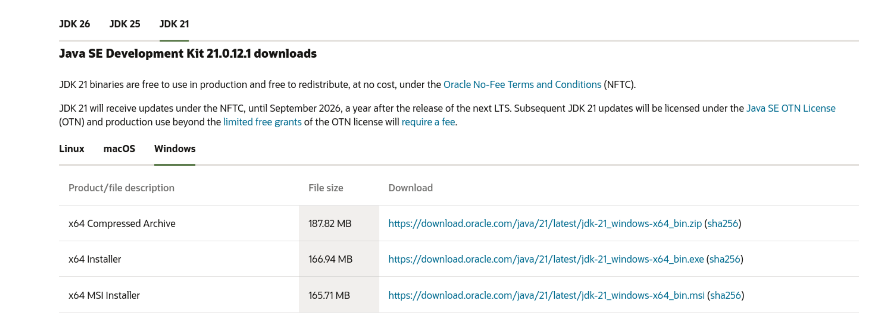
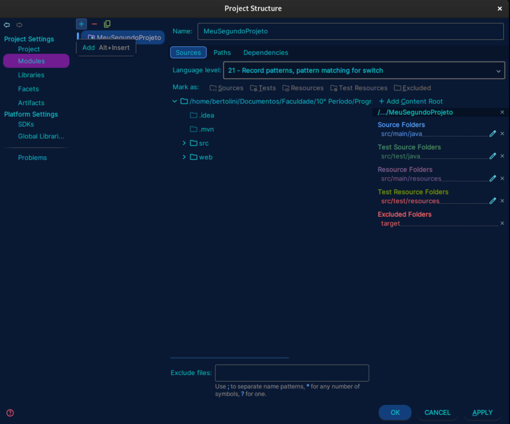
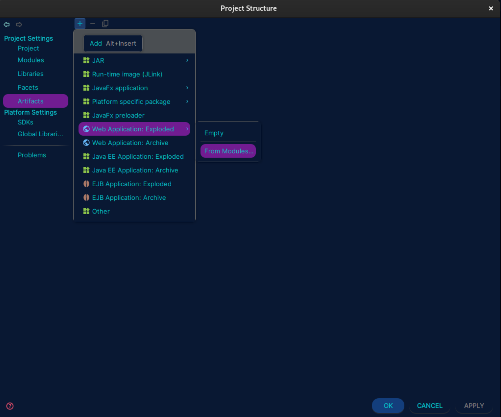
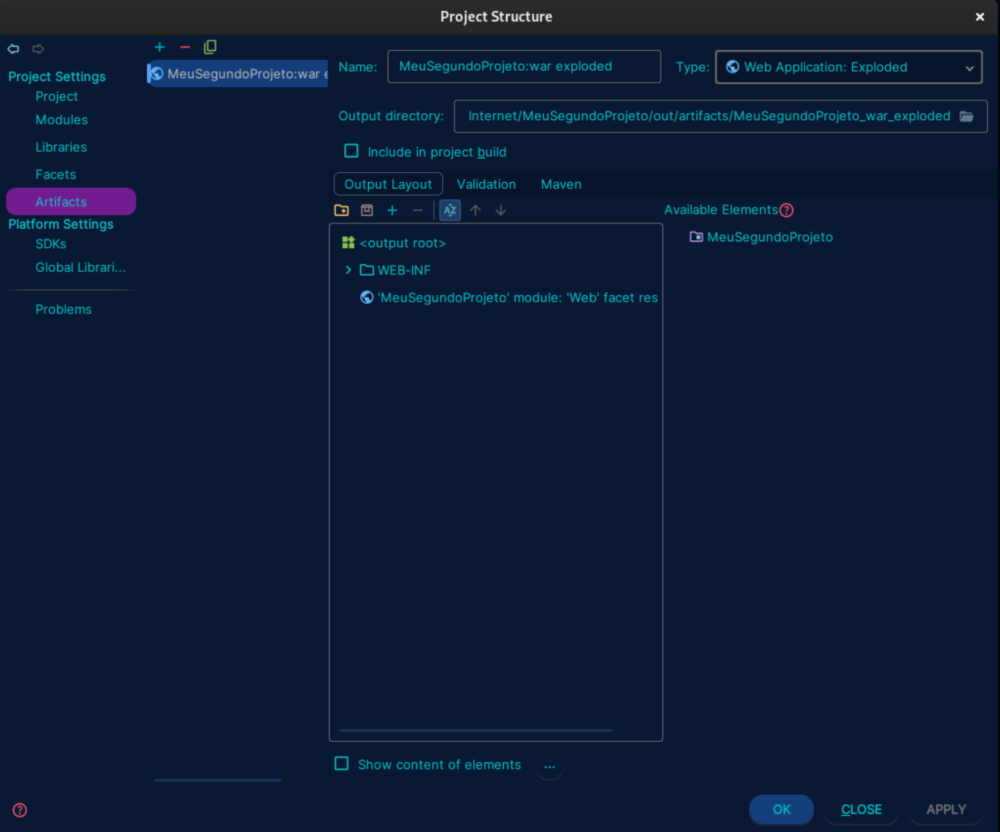
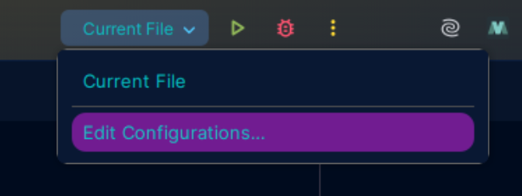
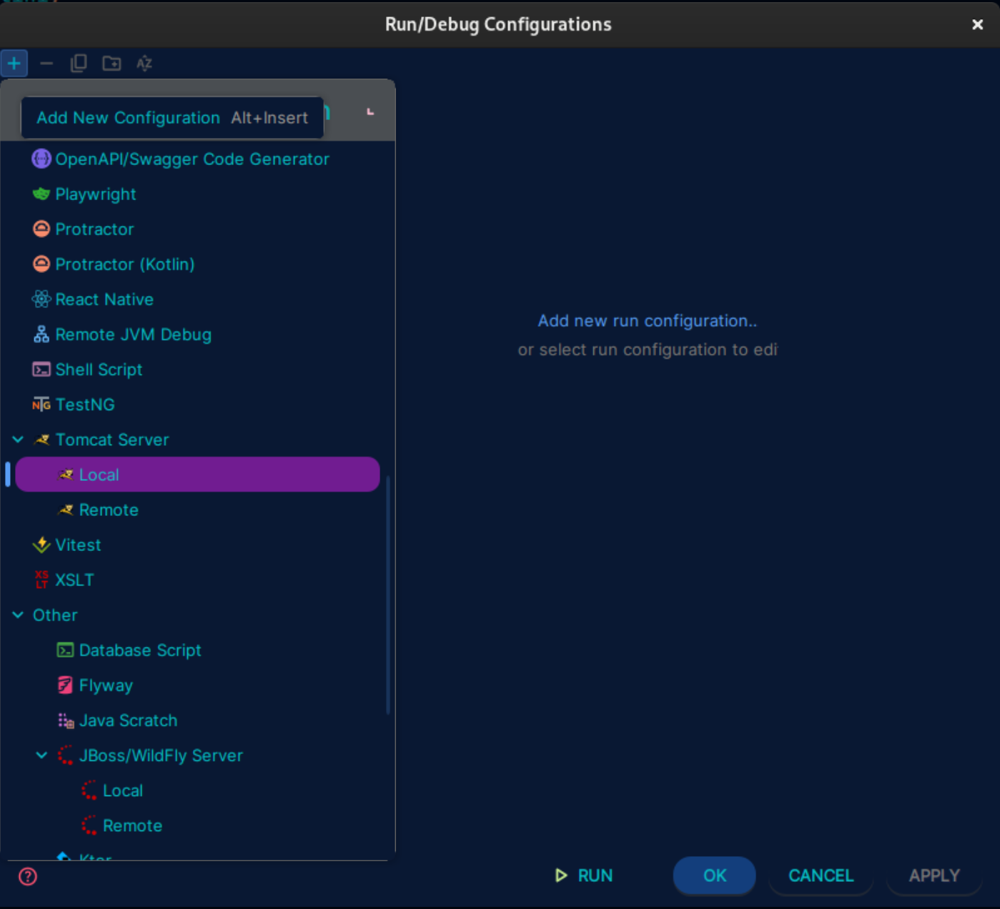
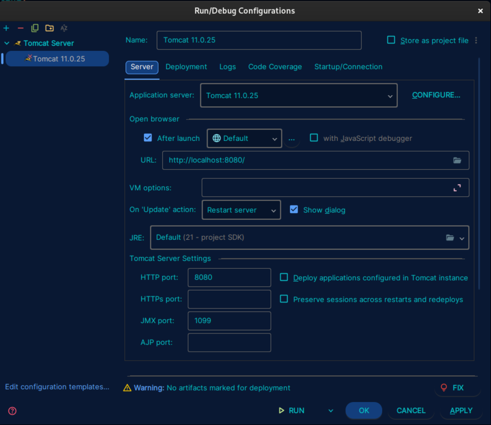
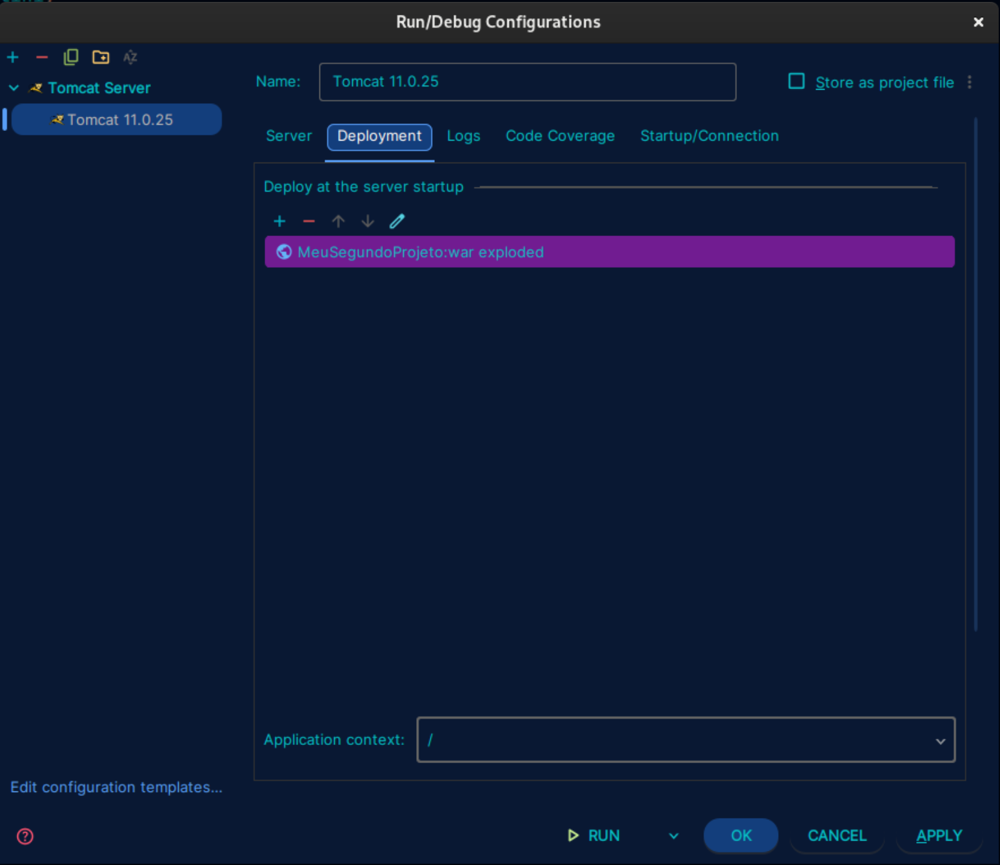
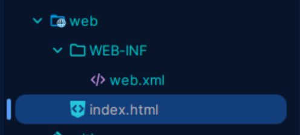

# Configuração do Ambiente

## Autor
Victor Bertolini de Sousa - https://github.com/VictorBertolini

## Baixar o `Java`

### Linux
```shell
sudo apt install openjdk-<versão>-jdk -y
```
Ex:
```shell
sudo apt install openjdk-21-jdk -y
```

### Windows

Baixe o `x64 Installer`

[JDK 21 - Windows](https://www.oracle.com/br/java/technologies/downloads/#jdk21-windows)




Para conferir se tudo correu bem:
```shell
java --version
```
```shell
javac --version
```

Se aparecer algo como:
```shell
openjdk 21.0.12.1 2026-08-18
```

E 
```shell
javac 21.0.12.1
```

Tudo correu bem!


## Baixar o `Tomcat`

### Linux
```shell
sudo apt install tomcat<versão>
```
Ex:
```shell
sudo apt install tomcat11
```

Para verificar se está ativo:
```shell
systemctl status tomcat<versão>
```
Ex:
```shell
systemctl status tomcat11
```

### Windows
[Tomcat 11 - Windows](https://tomcat.apache.org/download-11.cgi)


Para verificar se está correto, vá até o navegador e coloque:
```http
http://localhost:8080/
```
Se aparecer "It works !", logo o tomcat está preparado e rodando. Caso a aba não feche e todos os passos foram feitos, reinicie o computador e teste novamente o caminho http.


# Conectar o Tomcat ao IntelliJ

## Parte 1 - Configurando para aplicação Web

1) Vá até `File` no canto superior esquerdo
2) Clique em `Project Structure`
3) Clique em `Modules`
4) Clique em no seu projeto atual
5) Clique em `+` (Add)



6) Clique em `Web`
7) Clique em `Apply` e `Ok`


## Parte 2 - Apontando qual pasta tem a estrutura da página

1) Vá até `File` no canto superior esquerdo
2) Clique em `Project Structure`
3) Clique em `Artifacts`
4) Clique em `+`
5) Clique em `Web Application: Exploded`
6) Clique em `From Modules`



7) Clique na sua aplicação e `Ok`

Deve aparecer uma tela igual a essa:



8) Clique em `Apply` e `Ok`


## Parte 3 - Colocando o Tomcat para rodar a aplicação
1) Clique em `Current File` no canto superior direito 
2) Clique em `Edit Configurations`



3) Clique em `+` -> `Tomcat Server` -> `Local`




Vai abrir uma página de configuração como essa:



4) Se em `Application server` não tiver encontrado nenhum tomcat, clique em `Configure` e ache a pasta que está o tomcat 

5) Clique em `Deployment` 



6) Selecione o seu projeto

7) Em `Application context` deixe apenas `/`

8) Clique em `Apply` e `Ok`


## Parte 4 - Testando

1) Vá até a pasta `web` e crie um `index.html`



2) Cole o seguinte código:

```html
<!DOCTYPE html>
<html lang="pt-br">
<head>
    <meta charset="UTF-8">
    <title>Meu Aplicativo</title>
</head>
<body>
    <h1>Meu Aplicativo</h1>
    <h2>Tudo funciona perfeitamente bem</h2>
</body>
</html>
```

3) Abra o seu navegador e verifique se a página abriu, caso não tenha aberto, abra o link:
```http
http://localhost:8080/
```